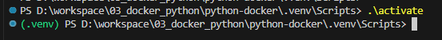
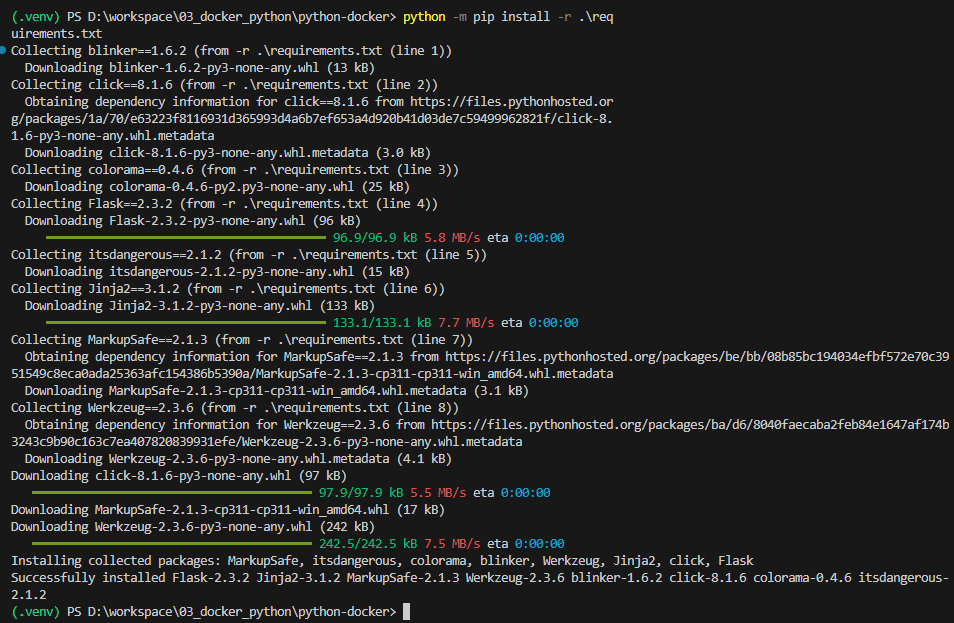
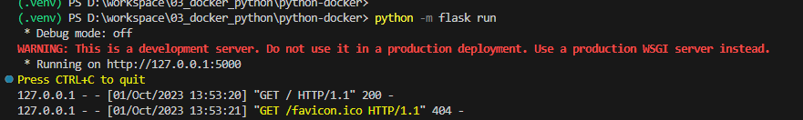

# 도커를 활용하여 파이썬 서버를 구축해보기

### 1. Dokcer 설치 및 이미지 준비 (windows)
---
도커 설치  [Download](https://www.docker.com/products/docker-desktop/)
* 도커에서 공식적으로 알려주는 가이드를 참고하여 수행
[Guide](https://docs.docker.com/language/python/build-images/)  

* docker에서 제공해주는 기본 python-docker 프로젝트를 clone

```
git clone https://github.com/docker/python-docker
```

<br>

* clone한 프로젝트에는 flask를 이용한 서버가 실행되도록 되어있음

```python
# app.py
from flask import Flask
app = Flask(__name__)

@app.route('/')
def hello_world():
    return 'Hello, Docker!'
```

<br>

* requirements.txt에 필요한 패키지들이 나열되어 있음  
```python
# requirements.txt
blinker==1.6.2
click==8.1.6
colorama==0.4.6
Flask==2.3.2
itsdangerous==2.1.2
Jinja2==3.1.2
MarkupSafe==2.1.3
Werkzeug==2.3.6
```
### 2. Python 가상환경 실행(windows)
powershell 등을 통해 위에서 clone 한 프로젝트 디렉토리로 이동
```python 
python -m venv venv 
#'venv'이름의 파이썬 가상환경 생성, 명령 실행 시 .venv내에 파일들이 자동으로 생성됨

# .venv\Script 디렉토리로 이동

./activate 실행
```

위와 같이 (.venv) 가 좌측에 생성되면 가상환경으로 실행됨을 의미

activate가 정상적으로 안되는 경우(windows) powershell 의 설정 변경이 필요
관련 내용은 아래 링크 참고  
[윈도우 powershell에서 가상환경 실행](https://dreamlog.tistory.com/603)
<br>
<br>
* 파이썬 가상 환경에 미리 정의된 패키지 설치
```
python -m pip install -r requirements.txt
```


<br>
<br>

* 패키지 정상적으로 설치되었는지 확인

<br>

